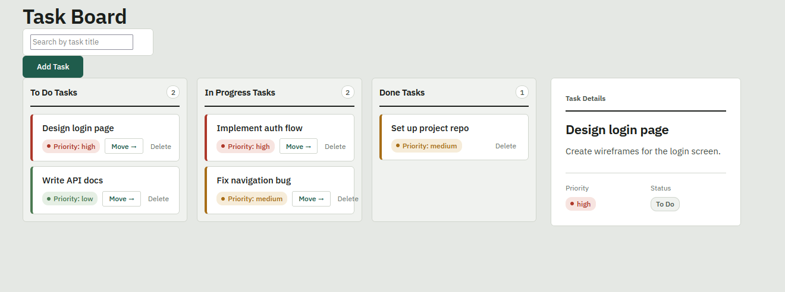

# Task Board

React app for tracking tasks across three stages, with priority badges, a detail panel, and search by title.

Built for the assignment **State Management and Event Handling in React**.

## Features

- **Three-column board:** To Do, In Progress, and Done. Each column shows a live count and an empty-state message when it has nothing to display.
- **Add tasks:** a form with title, description, and priority (low/medium/high). It opens from an "Add Task" button and can be cancelled. Inputs clear after each successful submission.
- **Move tasks:** a "Move →" button advances a task to the next stage. It is hidden once the task reaches Done.
- **Task detail panel:** clicking a card shows its title, description, priority, and status in a side panel. Clicking the same card again deselects it. The panel shows a placeholder prompt when nothing is selected.
- **Delete tasks:** each card has a Delete button with a confirmation prompt. Deleting the selected task clears the detail panel.
- **Search:** filters cards by title across all three columns. The empty-state message distinguishes between a column with no tasks and a column with no matches.
- **Priority styling:** each card carries a coloured left spine and a badge matching its priority level.
